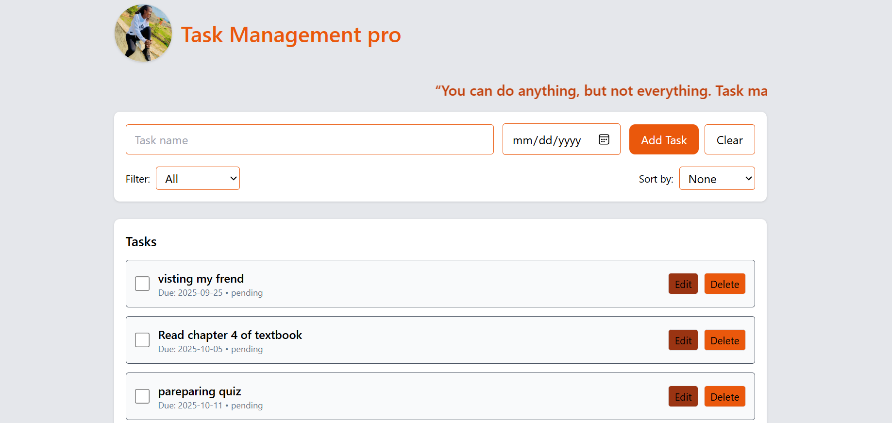

# Task Manager App

A simple **Task Manager** built with HTML, CSS (Tailwind), and JavaScript.  
This app allows users to add, edit, delete, filter, sort, and mark tasks as complete. Tasks are saved in **LocalStorage**, so they stay even after refreshing.

## Features
- Add new tasks with optional due dates  
- Edit existing tasks  
- Delete tasks  
- Mark tasks as completed or pending  
- Filter tasks (All / Pending / Completed)  
- Sort tasks by due date (ascending / descending)  
- Data persistence with LocalStorage  
- Smooth UI transitions using Tailwind CSS  


##  Project Structure
project-folder/
│── index.html # Main HTML file
│── index.js # JavaScript logic
│
│── README.md # Project documentation

 



## “Here’s how to install or set up this project.”

1. **Clone the repository**
   ```bash
   git clone https://github.com/gihozo-elyse/To-Do-List-Application

